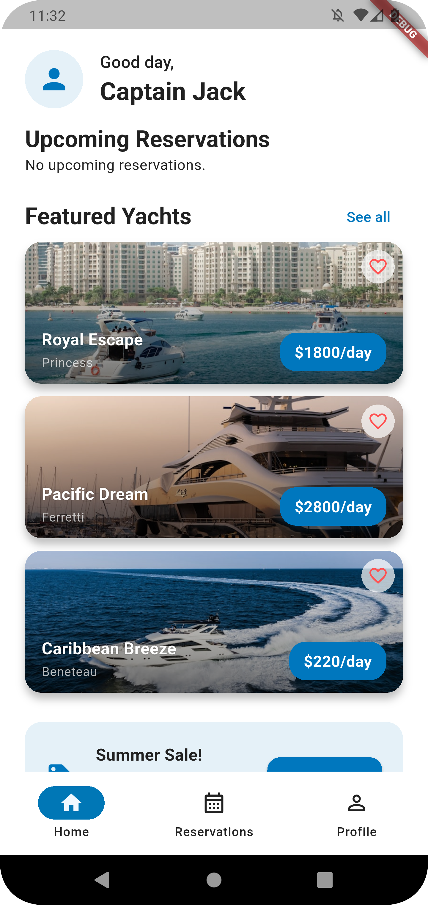
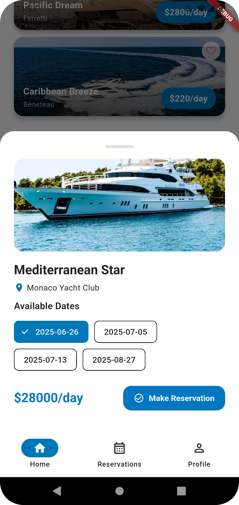
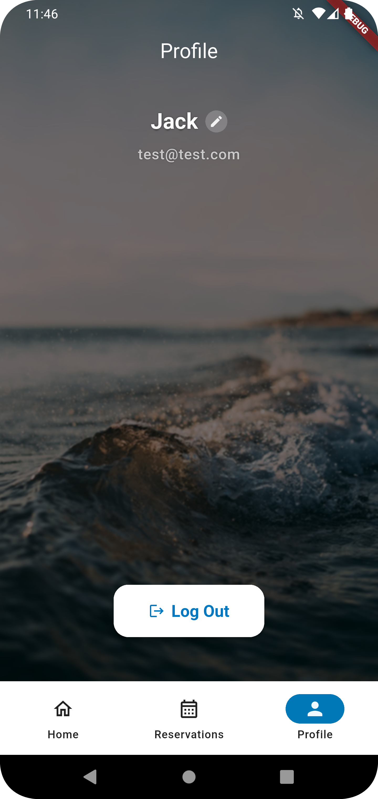
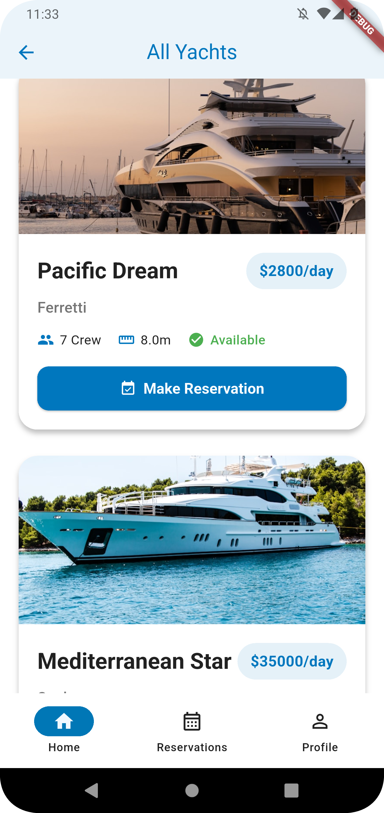
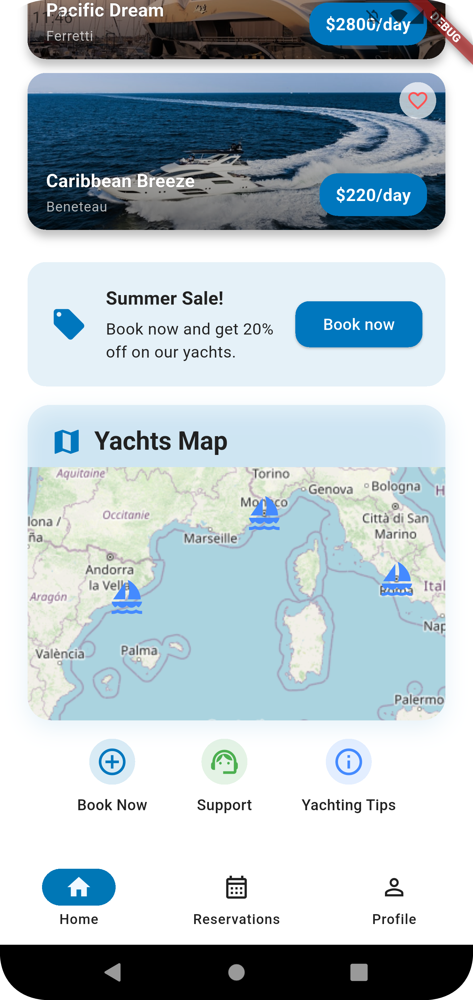

# 🛥️ Yacht Reservation App

**Yacht Reservation App** is a Flutter application that enhances the yacht booking experience.

### ✨ Key Highlights
- **Clean Architecture** with proper separation of concerns
- **State Management** using BLoC pattern for predictable data flow
- **Interactive Maps** for yacht location visualization
- **Real-time Booking** with promotional system integration
- **Cross-platform** support for iOS and Android
- **Modern UI/UX** with nautical-inspired design

---

## 🖼️ Screenshots Gallery

<div align="center">

### 📱 Mobile Screenshots

| Home | Booking Flow | Reservations |
|:---:|:---:|:---:|
|  |  |  |

| Profile | Interactive Map | Reservation Cards |
|:---:|:---:|:---:|
|  |  |  |

</div>

---

## 🏗️ Architecture & Tech Stack

### 🎯 Architecture Pattern
```
┌─────────────────────────────────────────────────────────────┐
│                    Presentation Layer                       │
│  ┌─────────────┐ ┌─────────────┐ ┌─────────────┐          │
│  │   Pages     │ │   Widgets   │ │   BLoC      │          │
│  └─────────────┘ └─────────────┘ └─────────────┘          │
└─────────────────────────────────────────────────────────────┘
┌─────────────────────────────────────────────────────────────┐
│                     Domain Layer                            │
│  ┌─────────────┐ ┌─────────────┐ ┌─────────────┐          │
│  │   Models    │ │  Services   │ │   Use Cases │          │
│  └─────────────┘ └─────────────┘ └─────────────┘          │
└─────────────────────────────────────────────────────────────┘
┌─────────────────────────────────────────────────────────────┐
│                      Data Layer                             │
│  ┌─────────────┐ ┌─────────────┐ ┌─────────────┐          │
│  │ Repository  │ │ DataSource  │ │   Network   │          │
│  └─────────────┘ └─────────────┘ └─────────────┘          │
└─────────────────────────────────────────────────────────────┘
```

### 🛠️ Technology Stack

| Category | Technology |
|----------|------------|
| **Framework** | Flutter |
| **Language** | Dart |
| **State Management** | management |
| **Navigation** | go_router |
| **Dependency Injection** | get_it + injectable |
| **Network** | Dio |
| **Maps** | flutter_map |
| **Storage** | shared_preferences | 
| **Code Generation** | build_runner |
| **Data Classes** | freezed | 3.0.6 |

## 🔧 Development Setup

### Prerequisites
```bash
# Required Software
Flutter SDK: 3.7.2+
Dart SDK: 3.0+
Android Studio / VS Code
iOS Simulator (macOS)
Android Emulator
```

### Quick Start
```bash
# 1. Clone the repository
git clone https://github.com/yourusername/yacht-reservation-frontend.git
cd yacht-reservation-frontend

# 2. Install dependencies
flutter pub get

# 3. Generate code
dart run build_runner build --delete-conflicting-outputs

# 4. Run the app
flutter run
```

### Backend Integration
This app requires the yacht reservation backend to be running. See the [backend repository](https://github.com/riddick-boss/yacht-reservation-backend) for setup instructions.